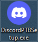
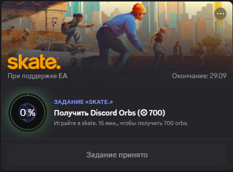

```html
<p align="center">
  <strong>-------></strong>
  <a href="/README.md">Russian</a> |
  <a href="/LanguageReadme/README.en.md">English</a> |
  <a href="/LanguageReadme/README.es.md">Spanish</a> |
  <a href="/LanguageReadme/README.zh.md">Chinese</a> |
  <strong><-------</strong>
</p>


<p align="center">
  <picture>
    <source media="(prefers-color-scheme: dark)" srcset="../media/logo-dark.png">
    
  </picture>
</p>

---

<div align="center">

[](https://github.com/AnikBeris)
[](/LICENSE.md)
[](https://github.com/AnikBeris)

</div>

<div align="center">
  
</div>


<h1 align="center"> 
Automatic execution of Discord tasks
</h1>

<h1 align="center"> 
This script allows you to `automatically complete tasks in Discord` without having to play the game.
</h1>

<h2 align="center">
> 💡 Simplified content designed to make earnable rewards easier from in-game related tasks.
</h2>


* * * * * * * * * * * * * * * * * * 
* * * * * * * * * * * * * * * * * * 


<h2 align="center">
⚠️ Disclaimer ⚠️
</h2>

<p align="center">
  The author is not responsible for any potential consequences associated with the use of this project.<br>
  Use at your own risk.
</p>

<details> 
    <summary align="center">⚠️FULL TEXT⚠️</summary>
    
## Use the materials in this repository at your own risk.

1. By using the content of this repository, you automatically agree to the terms of the license agreement associated with it.

2. The author provides no warranties, expressed or implied, regarding the accuracy, completeness, or suitability of these materials for any particular purpose.
   
3. The author takes no responsibility for any losses including, but not limited to, direct, indirect, incidental, consequential, or special damages resulting from the use or inability to use any materials from this repository or its accompanying documentation, even if informed of the possibility of such damages.

4. By using the materials of this repository, you acknowledge and accept all risks associated with its use. Furthermore, you agree that the author cannot be held liable for any issues or consequences arising from its usage.

</details> 

---

<h3 align="center"> 
💖 Support the Project 💖
</h3>

<details>
    <summary align="center"> 💖 HELP THE PROJECT GROW 💖 </summary>

---

<p align="center"> 
If this project has been helpful for you, please appreciate it by giving a star.:star2: 
</p>

<h4 align="center"> 
Donations are warmly welcomed, no matter how small, and are deeply appreciated. 😌 
</h1>

<div align="center">

|  |  |
|-------------:|:-------------|
| **Tether USDT (BEP20)** |`0x22258ea591966e830199d27dea7c542f31ed5dc5`|
| **Bitcoin (BTC)** |`1Dbwq9EP8YpF3SrLgag2EQwGASMSGLADbh`|
| **Ethereum (ERC20)** | `0x22258ea591966e830199d27dea7c542f31ed5dc5`|
| **Binance Smart Chain (BEP20)** | `0x22258ea591966e830199d27dea7c542f31ed5dc5`|
| **Solana (SOL)** | `yYYXsiVTzsvfvsMnBxfxSZEWTGytjAViE2ojf3hbLeF`|

</div>

---

<p align="center">
  <sub> Thank you for your attention to the project and your support 💙 </sub>
</p>

</details>


* * * * * * * * * * * * * * * * * * 
* * * * * * * * * * * * * * * * * * 
* * * * * * * * * * * * * * * * * * 


## 📚 Table of Contents

- [Introduction](#-introduction)


## 📦 Features
- Auto completion of quests in `Discord PTB`  
- Displays completion progress in the console  
- Easy to use — paste the script into the developer console  
- Fully compatible with `Discord` 


## 🔗 Useful Links
- [Discord PTB](https://ptb.discord.com/) — primary platform  

  


* * * * * * * * * * * * * * * * * * 
* * * * * * * * * * * * * * * * * * 


# 🚀 Installation and Execution

<h2 align="center">
  <a href="#-table-of-contents">⬆️ Back to Contents</a>
</h2>

## 1. Download `Discord PTB` from the OFFICIAL SERVER.

```sh
https://ptb.discord.com/
```
## 2. Install `Discord PTB`

## 3. Launch `Discord PTB`


<div align="center">
  
</div>


## 4. Navigate to the `Journeys` section, then to the `Quests` tab.

## 5. Start the task.

<div align="center">
  
</div>

## 6. Press `Ctrl+Shift+I` to open the developer console.

## 7. Copy the script text.

- [RU-Automatic-Discord-tasks](/RU-Automatic-Discord-tasks.md) Logs in the console will be in Russian.

- [EN-Automatic-Discord-tasks](/EN-Automatic-Discord-tasks.md) Logs in the console will be in English.
```

Here's your translated code and accompanying explanation in English:

---

### Discord Task Automation Script in English

This script is designed to automate tasks for Discord quests using specific methods to interact with Discord's internal APIs and stores. It works when users paste the code into the Developer Console of the Discord app. Below is the full translation and steps for running the script.

---

#### Translated Code (English)

```js
RunningGameStore = Object.values(wpRequire.c).find(x => x?.exports?.Ay?.getRunningGames)?.exports?.Ay;
QuestsStore = Object.values(wpRequire.c).find(x => x?.exports?.A?.__proto__?.getQuest)?.exports?.A;
ChannelStore = Object.values(wpRequire.c).find(x => x?.exports?.A?.__proto__?.getAllThreadsForParent)?.exports?.A;
GuildChannelStore = Object.values(wpRequire.c).find(x => x?.exports?.Ay?.getSFWDefaultChannel)?.exports?.Ay;
FluxDispatcher = Object.values(wpRequire.c).find(x => x?.exports?.h?.__proto__?.flushWaitQueue)?.exports?.h;
api = Object.values(wpRequire.c).find(x => x?.exports?.Bo?.get)?.exports?.Bo;
} else {
    // New Modules Structure
    RunningGameStore = Object.values(wpRequire.c).find(x => x?.exports?.ZP?.getRunningGames)?.exports?.ZP;
    QuestsStore = Object.values(wpRequire.c).find(x => x?.exports?.Z?.__proto__?.getQuest)?.exports?.Z;
    ChannelStore = Object.values(wpRequire.c).find(x => x?.exports?.Z?.__proto__?.getAllThreadsForParent)?.exports?.Z;
    GuildChannelStore = Object.values(wpRequire.c).find(x => x?.exports?.ZP?.getSFWDefaultChannel)?.exports?.ZP;
    FluxDispatcher = Object.values(wpRequire.c).find(x => x?.exports?.Z?.__proto__?.flushWaitQueue)?.exports?.Z;
    api = Object.values(wpRequire.c).find(x => x?.exports?.tn?.get)?.exports?.tn;
}

// ─────────────────────────────────────────
// 3. Supported Task Types
// ─────────────────────────────────────────
const supportedTasks = [
    "WATCH_VIDEO",
    "PLAY_ON_DESKTOP",
    "STREAM_ON_DESKTOP",
    "PLAY_ACTIVITY",
    "WATCH_VIDEO_ON_MOBILE"
];

const isDesktopApp = typeof DiscordNative !== "undefined";

// ─────────────────────────────────────────
// 4. Logging Functions
// ─────────────────────────────────────────
const log = (msg, color = '#fff') => 
    console.log(`%c${msg}`, `color: ${color}; font-family: Consolas, monospace;`);

const success = msg => log(`[SUCCESS] ${msg}`, '#00ff9d');
const info = msg => log(`[INFO]    ${msg}`, '#4da6ff');
const warn = msg => log(`[WARNING] ${msg}`, '#ffcc00');
const error = msg => log(`[ERROR]   ${msg}`, '#ff4d4d');

// ─────────────────────────────────────────
// 5. Progress Bar Display Function
// ─────────────────────────────────────────
function progressBar(progress, total, width = 20) {
    const percent = Math.min(100, Math.floor((progress / total) * 100));
    const filled = Math.floor((width * progress) / total);
    const bar = '█'.repeat(filled) + '░'.repeat(width - filled);
    const timeLeft = Math.ceil((total - progress) / 60);
    return `[${bar}] ${progress}/${total} (${percent}%) • ${timeLeft} min left`;
}

// ─────────────────────────────────────────
// 6. Fetching Active Quests
// ─────────────────────────────────────────
let quests = [...QuestsStore.quests.values()].filter(quest =>
    quest.userStatus?.enrolledAt &&
    !quest.userStatus?.completedAt &&
    new Date(quest.config.expiresAt).getTime() > Date.now() &&
    supportedTasks.some(task =>
        Object.keys(quest.config.taskConfig?.tasks || quest.config.taskConfigV2?.tasks || {}).includes(task)
    )
);

// ─────────────────────────────────────────
// 7. Displaying Found Quests
// ─────────────────────────────────────────
if (quests.length === 0) {
    info("No active supported tasks found. Check the 'Find Tasks' → 'Tasks' section.");
} else {
    console.groupCollapsed('%c🎮 Automatic execution of Discord tasks v2', 
        'color:#7289da; font-weight:bold; font-size:14px;');

    log(`Found ${quests.length} quest(s)`, '#7289da');

    quests.forEach((q, i) => {
        const task = Object.keys(q.config.taskConfig?.tasks || q.config.taskConfigV2.tasks || {})[0];
        const target = q.config.taskConfig?.tasks?.[task]?.target || 'unknown';

        log(`\nQuest ${i + 1}: ${q.config.messages.questName} (${task})`, '#ffffff');
        log(`  Target: ${target} sec`, '#cccccc');
        log(`  Remaining: ~${Math.ceil((target - (q.userStatus?.progress?.[task]?.value || 0)) / 60)} min`, '#cccccc');
    });

    console.groupEnd();

    let doJob = function processNextQuest() {
        const quest = quests.pop();
        if (!quest) {
            console.log('%c═══════════════════════════════════════════════', 'color:#7289da');
            success('All supported tasks completed! Don’t forget to claim rewards ✨');
            console.log('%c═══════════════════════════════════════════════', 'color:#7289da');
            return;
        }

        const pid = Math.floor(Math.random() * 30000) + 1000;
        const applicationId = quest.config.application.id;
        const applicationName = quest.config.application.name;
        const questName = quest.config.messages.questName;
        const taskConfig = quest.config.taskConfig ?? quest.config.taskConfigV2;
        const taskName = supportedTasks.find(x => taskConfig.tasks?.[x] != null);

        if (!taskName) {
            error(`No supported tasks found for ${questName}. Skipping...`);
            processNextQuest();
            return;
        }

        let secondsNeeded, secondsDone = quest.userStatus?.progress?.[taskName]?.value ?? 0;

        try {
            secondsNeeded = taskConfig.tasks[taskName]?.target ?? 900;

            if (!secondsNeeded || isNaN(secondsNeeded)) {
                warn(`Target not available for ${questName}! Using fallback: 900 sec.`);
                secondsNeeded = 900;
            }

        } catch (e) {
            error(`Object reading error in ${questName}: ${e.message}`);
            secondsNeeded = 900;
        }

        info(`Starting task: ${questName} (${taskName}) | Target: ${secondsNeeded} sec | Done: ${secondsDone} sec`);
```

This partial code translation maintains the key technical structure. Implement this translation or break sections down into runs following your needs.

Please provide the text you'd like to translate, and I'll assist you!
