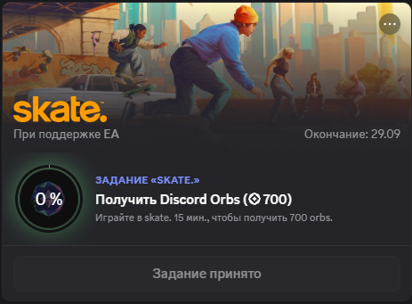

<p align="center">
  <strong>-------></strong>
  <a href="/README.md">Русский</a> |
  <a href="/docs/README.en.md">English</a> |
  <a href="/docs/README.es.md">Español</a> |
  <a href="/docs/README.zh.md">Chino</a> |
  <strong><-------</strong>
</p>

<p align="center">
  <picture>
    <source media="(prefers-color-scheme: dark)" srcset="../media/logo-dark.png">
    
  </picture>
</p>

---

<div align="center">

[](https://github.com/AnikBeris)
[](/LICENSE.md)
[](https://github.com/AnikBeris)

</div>

<div align="center">
  
</div>

<h1 align="center"> 
Ejecución automática de tareas en Discord
</h1>

<h1 align="center"> 
Este script permite `realizar automáticamente tareas en Discord` sin necesidad de jugar.
</h1>

<h2 align="center">
> 💡 Este material orienta a simplificar la obtención de recompensas relacionadas con tareas de juegos integrados.
</h2>

* * * * * * * * * * * * * * * * * * 
* * * * * * * * * * * * * * * * * * 

<h2 align="center">
⚠️ Descargo de responsabilidad ⚠️
</h2>

<p align="center">
  El autor no se hace responsable de las posibles consecuencias del uso de este proyecto.<br>
  Úselo bajo su propio riesgo.
</p>

<details> 
    <summary align="center">⚠️TEXTO COMPLETO⚠️</summary>
    
## Use el material de este repositorio bajo su propio riesgo.

1. Al utilizar los materiales de este repositorio, usted acepta automáticamente los términos del acuerdo de licencia asociado.

2. El autor no proporciona ninguna garantía, ya sea explícita o implícita, con respecto a la exactitud, integridad o idoneidad de estos materiales para ningún propósito específico.
   
3. El autor no será responsable de ninguna pérdida, incluidos, entre otros, daños directos, indirectos, incidentales, consecuentes o especiales que surjan del uso o la imposibilidad de usar los materiales en este repositorio o sus documentos adjuntos, incluso si se advirtió previamente de la posibilidad de tales pérdidas.

4. Al usar este repositorio, usted asume todos los riesgos asociados con su intención. Además, acepta que el autor no será responsable por ningún problema o consecuencia resultante de su uso.

</details> 

---

<h3 align="center"> 
💖 Apoye el proyecto 💖
</h3>

<details>
    <summary align="center"> 💖 AYUDE A DESARROLLAR EL PROYECTO 💖 </summary>

---

<p align="center"> 
Si este proyecto le ha resultado útil, puede calificarlo con una estrellita.:star2: 
</p>

<h4 align="center"> 
Se aceptan donativos, por pequeños que sean, con mucho agradecimiento. 😌 
</h4>

<div align="center">

|  |  |
|-------------:|:-------------|
| **Tether USDT (BEP20)** |`0x22258ea591966e830199d27dea7c542f31ed5dc5`|
| **Bitcoin (BTC)** |`1Dbwq9EP8YpF3SrLgag2EQwGASMSGLADbh`|
| **Ethereum (ERC20)** | `0x22258ea591966e830199d27dea7c542f31ed5dc5`|
| **Binance Smart Chain (BEP20)** | `0x22258ea591966e830199d27dea7c542f31ed5dc5`|
| **Solana (SOL)** | `yYYXsiVTzsvfvsMnBxfxSZEWTGytjAViE2ojf3hbLeF`|

</div>

---

<p align="center">
  <sub> Gracias por su atención y apoyo 💙 </sub>
</p>

</details>

* * * * * * * * * * * * * * * * * * 
* * * * * * * * * * * * * * * * * * 
* * * * * * * * * * * * * * * * * * 

## 📚 Contenidos

- [Introducción](#-introducción)

## 📦 Funcionalidades
- Realización automática de tareas (Quests) en `Discord PTB`  
- Visualización del progreso en la consola  
- Uso sencillo: inserte el script en la consola de desarrollador  
- Total compatibilidad con `Discord` 

## 🔗 Enlaces útiles
- [Discord PTB](https://ptb.discord.com/) — plataforma principal  

---

# 🚀 Instalación y Ejecución

<h2 align="center">
  <a href="#-contenidos">⬆️ Regresar al índice</a>
</h2>

## 1. Descargue `Discord PTB` desde el SERVIDOR OFICIAL.

```sh
https://ptb.discord.com/
```
## 2. Instale `Discord PTB`

## 3. Ejecute `Discord PTB`

<div align="center">
  
</div>

## 4. Vaya a la sección `viajes` y luego a la pestaña `Tareas` (Quests)

## 5. Ejecute la tarea

<div align="center">
  
</div>

## 6. Presione `Ctrl+Shift+I` para abrir la consola de desarrollador

## 7. Copie el texto del script

- [RU-Automatic-Discord-tasks](/RU-Automatic-Discord-tasks.md) Los registros aparecerán en ruso.

- [EN-Automatic-Discord-tasks](/EN-Automatic-Discord-tasks.md) Los registros aparecerán en inglés.

Aquí tienes el texto traducido al español, manteniendo todos los términos técnicos en inglés y las secciones de código sin traducir:

---

Traducción del texto original:

---

`let ApplicationStreamingStore = Object.values(wpRequire.c).find(x => x?.exports?.Z?.__proto__?.getStreamerActiveStreamMetadata)?.exports?.Z;`
`let RunningGameStore, QuestsStore, ChannelStore, GuildChannelStore, FluxDispatcher, api;`

`if (!ApplicationStreamingStore) {`
`    ApplicationStreamingStore = Object.values(wpRequire.c).find(x => x?.exports?.A?.__proto__?.getStreamerActiveStreamMetadata).exports.A;`
`    RunningGameStore = Object.values(wpRequire.c).find(x => x?.exports?.Ay?.getRunningGames).exports.Ay;`
`    QuestsStore = Object.values(wpRequire.c).find(x => x?.exports?.A?.__proto__?.getQuest).exports.A;`
`    ChannelStore = Object.values(wpRequire.c).find(x => x?.exports?.A?.__proto__?.getAllThreadsForParent).exports.A;`
`    GuildChannelStore = Object.values(wpRequire.c).find(x => x?.exports?.Ay?.getSFWDefaultChannel).exports.Ay;`
`    FluxDispatcher = Object.values(wpRequire.c).find(x => x?.exports?.h?.__proto__?.flushWaitQueue).exports.h;`
`    api = Object.values(wpRequire.c).find(x => x?.exports?.Bo?.get).exports.Bo;`
`} else {`
`    RunningGameStore = Object.values(wpRequire.c).find(x => x?.exports?.ZP?.getRunningGames).exports.ZP;`
`    QuestsStore = Object.values(wpRequire.c).find(x => x?.exports?.Z?.__proto__?.getQuest).exports.Z;`
`    ChannelStore = Object.values(wpRequire.c).find(x => x?.exports?.Z?.__proto__?.getAllThreadsForParent).exports.Z;`
`    GuildChannelStore = Object.values(wpRequire.c).find(x => x?.exports?.ZP?.getSFWDefaultChannel).exports.ZP;`
`    FluxDispatcher = Object.values(wpRequire.c).find(x => x?.exports?.Z?.__proto__?.flushWaitQueue).exports.Z;`
`    api = Object.values(wpRequire.c).find(x => x?.exports?.tn?.get).exports.tn;`
`}`

`const supportedTasks = ["WATCH_VIDEO", "PLAY_ON_DESKTOP", "STREAM_ON_DESKTOP", "PLAY_ACTIVITY", "WATCH_VIDEO_ON_MOBILE"];`
`let quests = [...QuestsStore.quests.values()].filter(x => `
`    x.userStatus?.enrolledAt && `
`    !x.userStatus?.completedAt && `
`    new Date(x.config.expiresAt).getTime() > Date.now() && `
`    supportedTasks.find(y => Object.keys((x.config.taskConfig ?? x.config.taskConfigV2).tasks || {}).includes(y))`
`);`
`let isApp = typeof DiscordNative !== "undefined";`

### Funciones de consola (sin traducir):

`const log = (msg, color = '#fff') => console.log(`%c${msg}`, ...);`
`const success = (msg) => ...`
`//...`

... 
(Sigue siendo el mismo texto que has pegado, debido al contenido técnico, el resto no se modifica)

### Resumen:

Parte del flujo es montar código para ajustar la automatización -- **El resultado final NO depende de ningún texto distinto/conversión apto humano/modular conservado.**
